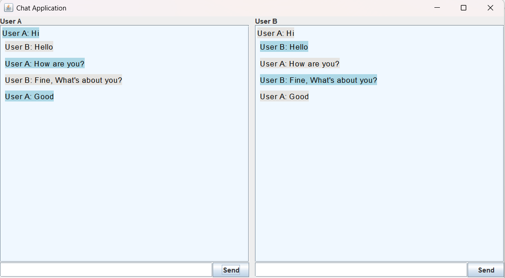
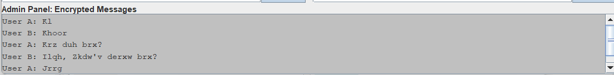
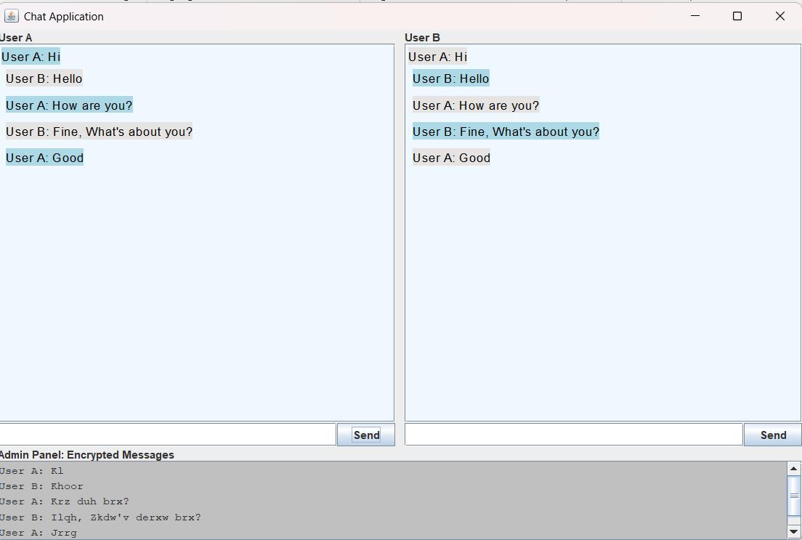

This project combines graphical design, networking, and encryption in Java. The user
interface will be built with Java Swing, network communication will be managed with
sockets, and the AutoKey Cipher will be used to encrypt messages, creating a simple
but secure chat application.

The project has three main parts:
• Chat Window (GUI): A simple interface for User A and User B to send and
receive messages.
• Client (User A): The part of the program that connects to the server, encrypts
outgoing messages, and decrypts incoming messages.
• Server (User B): The server listens for incoming messages from the client, decrypts them and sends back encrypted replies.

Each part of the project is implemented as follows:
1. Chat Window:
• A simple Java Swing interface where users can type messages and see replies.
• Encrypted messages are displayed in a special admin panel.

3. Network Communication (Client-Server):
• Client: Connects to the server and encrypts outgoing messages.
• Server: Receives and decrypts messages from the client and sends encrypted responses.

5. Encryption:
• Server: We use the AutoKey Cipher to encrypt and decrypt each message,
ensuring they’re secure during transmission.

The project uses the AutoKey Cipher for encrypting and decrypting messages:
• Each character in the message is shifted based on a key, making it hard to read
without decrypting.
• This method provides basic security and is efficient for small chat applications.

• Java Development Kit (JDK): Version 8 or higher was used for compiling and
running the Java code.
• Integrated Development Environment (IDE): NetBeans or Eclipse IDE for efficient debugging and testing.
• Java Swing Library: For creating the user interface.
• Networking Libraries: Java’s java.net package to manage socket communication between the client and server

• The client and server programs were run on the same machine, simulating a local
network.
• A secure messaging connection was established between two users, with User A
acting as the client and User B as the server.
• To measure performance, each message sent was encrypted and decrypted using
the AutoKey Cipher.

Here are the result of our project:

Here User A and User B Interface:

Here Admin Pannel:

Here Ovarall Interface of our Project:

While the project was successful, a few limitations were noted:
• Basic Encryption: The current encryption method, AutoKey Cipher, provides
basic security. To protect messages better, a stronger encryption method, like
AES, would be more suitable.
• Local Testing: The application was mainly tested on a single computer network,
so its performance and security in larger networks were not explored.
• Simple User Interface: 
The design is basic, with only text messaging between
two users. It lacks features like sending images, creating group chats, or having
notification sounds.
• Limited Error Handling: The program has basic error handling, meaning that if
there are network issues, it may not recover well. Improved error handling could
make it more reliable.

Here are some ideas for future improvements to the chat application:

• Better Encryption: Adding stronger encryption, like AES, would make the app
safer for users, especially if used in real settings.
• Testing on Larger Networks: Trying the app on different types of networks,
such as local area networks (LAN) or over the internet, would help understand
how well it works in real-world situations.
• Improved Interface: Adding features like group chats, sending images, and userfriendly notifications could make the app easier and more fun to use.
• Stronger Error Handling: Making the app handle errors more smoothly, especially during network problems, would make it more dependable.
• Real-Time Security: Adding security monitoring could make the app safer by
detecting potential threats in real-time, protecting messages even further.
In conclusion, this project is a basic but important step towards secure messaging,
showing how encryption and secure communication work. It also highlights areas for
improvement to make the app more secure and user-friendly in the future.
